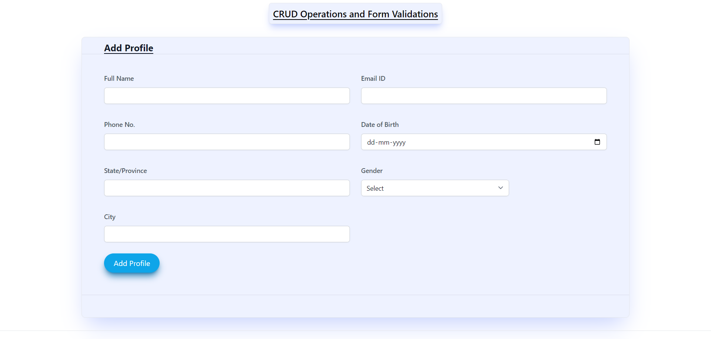
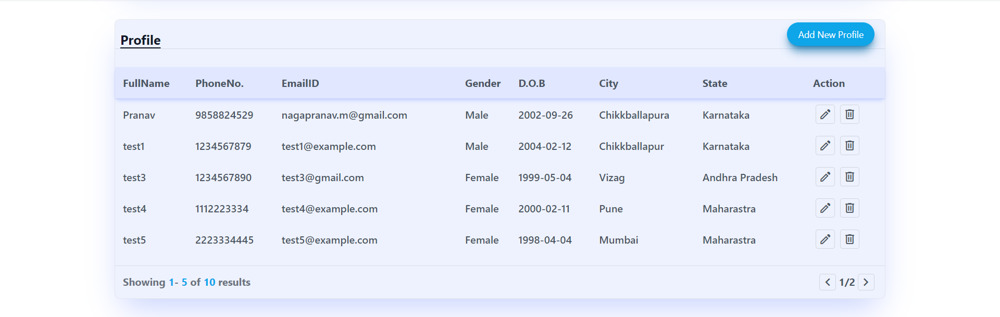

# CRUD Operations and Form Validations

This React application allows you to perform CRUD (Create, Read, Update, Delete) operations on a list of user profiles. Additionally, it includes form validations to ensure the data entered is accurate and complete. Below, you will find an overview of the application's components and how to use them.

## Sample Screenshots




## Table of Contents
- [Components](#components)
- [Usage](#usage)
- [Form Validations](#form-validations)
- [How to Run](#how-to-run)

---

## Components

### ProfileForm

The `ProfileForm` component is responsible for adding new profiles and editing existing ones. It includes the following fields:

- Full Name
- Email ID
- Phone Number
- Date of Birth
- State/Province
- Gender
- City

The form enforces various validations to ensure the entered data is accurate. These validations include:

- Full Name: Required, maximum 20 characters.
- Email ID: Required, must have a valid email format.
- Phone Number: Required, must be 10 digits.
- Date of Birth: Required, and the user must be at least 18 years old.
- State/Province: Required.
- Gender: Required.
- City: Required.
- 
### Table

The `Table` component displays a table of user profiles. It includes pagination to navigate through multiple profiles. You can perform the following actions on each profile:

- Edit: Update the profile's information.
- Delete: Remove the profile from the list.
- 
### DeleteConfirmationModal

The `DeleteConfirmationModal` component is a confirmation dialog that appears when you attempt to delete a profile. It asks for confirmation before permanently deleting a profile.

### Modal

The `Modal` component provides a generic modal structure that can be used to display various types of content with a close button.

---

## Usage

1. **Adding a New Profile**:
   - Click the "Add New Profile" button in the "Profile" section of the application.
   - Fill in the required information in the form fields.
   - Click the "Add Profile" button to save the new profile.

2. **Editing an Existing Profile**:
   - Click the "edit" button next to the profile you want to edit in the table.
   - Modify the profile information in the form.
   - Click the "Update Profile" button to save the changes.

3. **Deleting a Profile**:
   - Click the "delete" button next to the profile you want to delete in the table.
   - A confirmation modal will appear.
   - Click "Yes" to confirm the deletion or "Cancel" to abort.

---

## Form Validations

The form validations are designed to ensure the accuracy and completeness of the data entered into the profile form. Here are the specific validations:

- **Full Name**: Required, and it should not exceed 20 characters in length.

- **Email ID**: Required and must have a valid email format.

- **Phone Number**: Required, and it must be exactly 10 digits.

- **Date of Birth**: Required, and the user must be at least 18 years old.

- **State/Province**: Required.

- **Gender**: Required.

- **City**: Required.

---

## How to Run

To run the application, follow these steps:

1. Clone the repository to your local machine.

2. Navigate to the project directory using your terminal.

3. Install the necessary dependencies by running:

   ```bash
   npm install
   ```

4. Start the development server:

   ```bash
   npm start
   ```

5. Open your web browser and go to `http://localhost:3000` to access the application.

Now you can use the CRUD operations and form validations to manage user profiles effectively.

Thank you for using this CRUD application with form validations! If you have any questions or encounter any issues, please feel free to reach out.
